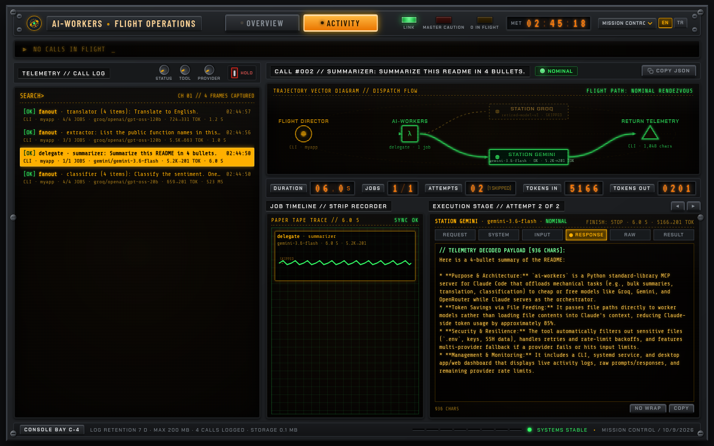
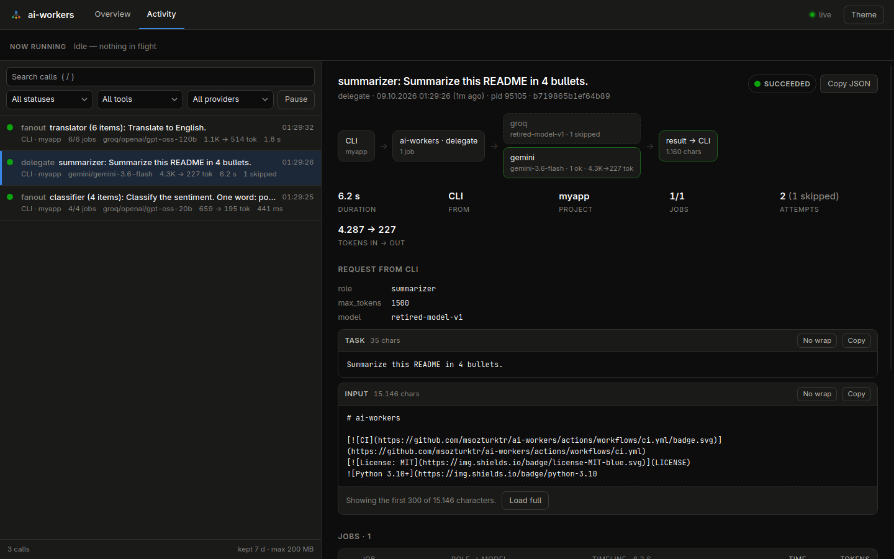
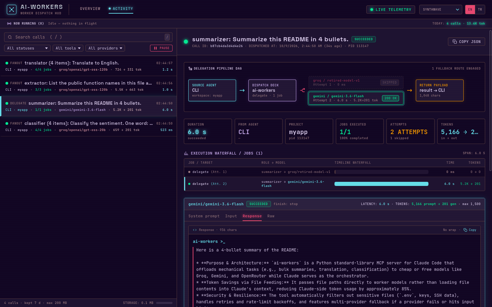
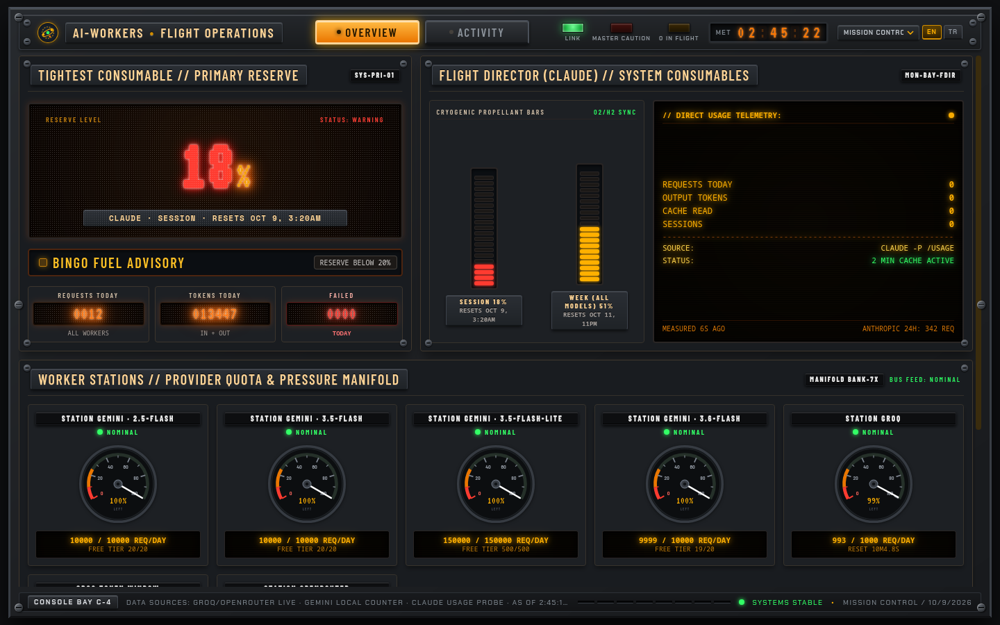
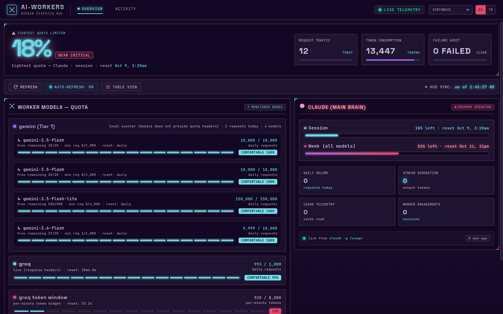

# ai-workers

[](https://github.com/msozturktr/ai-workers/actions/workflows/ci.yml)
[](LICENSE)


A worker-pool [MCP](https://modelcontextprotocol.io) server for Claude Code. Claude stays the
orchestrator (planning, decisions, review); mechanical work such as bulk summaries,
translation, classification and log scanning goes to cheap or free API models
(Groq, Gemini, OpenRouter).

The main trick is **file feeding**: Claude passes only paths, the server reads the files and
returns only the worker's answer, so file contents never enter Claude's context. In measured
runs this cut Claude-side tokens by **~90-99%** ([details](#measured-token-savings)).

- **No dependencies.** Server, CLI and dashboard use the Python standard library only.
- **Resilient.** Same-provider model pool, then fallback across providers, a token-bucket
  limiter, cooldowns for exhausted models, retries that honour `Retry-After`, per-job failure
  isolation in parallel runs.
- **Frugal.** A 7-day result cache (identical job: no provider call), request packing for
  short items and keep-alive connections.
- **Safe by default.** Secret files (`.env`, keys, `~/.ssh`, ...) are never sent to a provider.
- **Observable.** A desktop app with a live activity log (who sent what to which model, every
  retry and fallback, the exact prompts and responses) and the remaining quota of every
  provider, including Claude itself. Three themes, English and Turkish.



## Contents

- [Quick start](#quick-start)
- [How it works](#how-it-works)
- [File feeding](#file-feeding)
- [Measured token savings](#measured-token-savings)
- [Desktop app](#desktop-app)
- [Command line](#command-line)
- [Configuration](#configuration)
- [Quota tracking](#quota-tracking)
- [Resilience and provider notes](#resilience-and-provider-notes)
- [Project layout](#project-layout)
- [Development](#development)
- [Changelog](#changelog)

## Quick start

Requirements: Python 3.10+ and an API key for at least one provider. The MCP server runs
anywhere Python does; `install.sh` (CLI, background service, desktop entry) targets Linux.

```bash
git clone https://github.com/msozturktr/ai-workers.git
cd ai-workers

mkdir -p ~/.config/ai-workers
printf 'GROQ_API_KEY=...\n' > ~/.config/ai-workers/env    # see "Configuration"
chmod 600 ~/.config/ai-workers/env

claude mcp add ai-workers --scope user -- python3 "$PWD/server.py"
bash install.sh       # optional: `ai-workers` CLI, dashboard service, desktop app
ai-workers doctor     # optional: check the setup
```

Then ask Claude Code for the work, e.g. *"summarize every file in src/ in 3 bullets"*. The
server's instructions tell Claude to use `fanout` with `files` for that.

## How it works

```
you ─▶ Claude Code  (planning, decisions, quality control)
          │
          ▼  MCP
      ai-workers
        ├─ delegate(role, task, files?)    one job
        ├─ fanout(items[] | files[])       N parallel jobs (one per file or item)
        ├─ ask(provider, prompt)           direct model call
        ├─ models(provider)                live model list
        ├─ usage()                         remaining quota of every provider
        └─ org_status()                    keys, roles and their models
          │
          ▼
      Groq · Gemini · OpenRouter
```

**Claude Code integration.** The `initialize` response carries `instructions`, so every
session's system prompt says when to hand work off and how to pass `files`. `delegate` and
`fanout` are marked `_meta["anthropic/alwaysLoad"]` and are loaded with their full schema
instead of being deferred to tool search. Tool calls run in threads, so a long `fanout` never
blocks `ping` or other calls.

### Roles

| role       | provider   | model                                  | use for                       |
|------------|------------|----------------------------------------|-------------------------------|
| researcher | gemini     | gemini-3.6-flash                       | long documents, research      |
| summarizer | groq       | openai/gpt-oss-120b                    | bulk summarization            |
| coder      | groq       | openai/gpt-oss-120b                    | scaffolding, boilerplate      |
| reviewer   | openrouter | nvidia/nemotron-3-ultra-550b-a55b:free | second opinion, critique      |
| translator | groq       | openai/gpt-oss-120b                    | translation                   |
| classifier | groq       | openai/gpt-oss-20b                     | tagging, triage (fastest)     |
| extractor  | groq       | openai/gpt-oss-120b                    | structured JSON extraction    |

**Routing.** `providers.run` tries the role's model first, then the other models of the same
provider (Groq pool: `openai/gpt-oss-120b`, `qwen/qwen3.8-27b`, `openai/gpt-oss-20b`), then the
other providers in the order Groq → Gemini → OpenRouter. Each Groq model has its own 8K
tokens/minute bucket, so siblings are used before paid Gemini; a busy sibling is skipped without
waiting. An explicit `model` argument disables the siblings; `no_fallback` keeps them but skips
other providers.

**Answer length.** `max_tokens` is sized automatically per role and call. A role can set
`max_tokens` (cap), `min_tokens` and `out_ratio` (answer at least `out_ratio` x the input
estimate, e.g. translation). An explicit `max_tokens` overrides this. Measured 2026-10-10: Groq
no longer charges `max_tokens` up front, only the tokens actually used, so a larger value costs
no quota.

Bulk work runs on Groq (free, 1,000 requests/day). Gemini (Tier 1, paid) serves the researcher
role and any input too large for Groq. Roles can be changed or added in
[`config.json`](#configuration).

**Output language.** Workers answer in the language of the *task* instruction, not of the
input data (an English task over Turkish-commented code gets an English answer), unless the
task asks for another language. A length or format requested in the task overrides the role's
default. This rule is appended to every role, custom ones included.

## File feeding

`delegate` and `fanout` accept `files`: absolute paths, directories or globs (`~` works). The
server reads them; Claude only sees the worker's output.

```python
delegate(role="summarizer", task="...", files=["~/code/myapp/README.md"])
fanout(role="classifier", task="...", files=["~/code/myapp/src/**/*.py"])
```

- `delegate` merges all files into one input. `fanout` makes one job per file (max 200 jobs).
- **Output to disk.** `delegate` takes `output_file`, `fanout` takes `output_dir` (one
  `NNN-label.md` per job) or, with `reduce`, `output_file`. Results are written there and only
  the path and a preview are returned, so long outputs stay out of Claude's context. Secret
  paths are refused, and so are existing files unless `overwrite: true`.
- **Map-reduce.** `fanout` with `reduce` (an instruction) runs a final job over all outputs and
  returns one merged answer; `reduce_role` picks its role (default `summarizer`).
- **Packing.** For `classifier`, `extractor` and `translator`, four or more short items with the
  same task are packed up to 20 per request. The model answers with a JSON array that is mapped
  back to the items; unparsed or missing items are re-run individually. Measured: 30 sentiment
  items took 2 requests and 30/30 were correct. Short answers are rendered one line per item.
- **Result cache.** An identical job (role, model, task, input) is answered from
  `~/.config/ai-workers/cache` for 7 days without calling a provider. `no_cache: true` skips it.
  Cache hits appear in the ledger and in the usage report's Efficiency section.
- **Whole files for understanding.** `summarizer`, `researcher` and `reviewer` never split a
  file; one that exceeds Groq's budget goes to Gemini in one piece. Chunks lose context and made
  summaries invent things.
- **Chunks for local work.** Other roles split large files on line boundaries (`chunk_chars`,
  default: the provider's budget, Groq ≈ 11K and Gemini 200K characters). Override per call with
  `whole_files: true|false`.
- **Never sent:** secret files (`.env*`, `*.pem`, `*.key`, `id_rsa*`, `credentials*`,
  `*secret*`, `~/.ssh`, `~/.config/ai-workers`, ...), binary files, files over 8 MB. Directory
  and glob scans skip `.git`, `node_modules`, `__pycache__`, `.venv`, `obj`, `bin`, `.next`, ...
- **Input budgets.** Groq's free tier gives every model its own token bucket (8K tokens per
  minute, refilling continuously) and does not charge `max_tokens` up front, only the real
  prompt and completion. A request is admitted when the bucket holds its input tokens, so the
  per-request input limit is `min(TPM, ITPM) − 200` tokens (about 24K characters; qwen has a
  separate 7000-token input limit, learned from errors and kept in `state.json`). When the bucket
  is short the call waits the exact refill time (at most 30 s), otherwise it moves on to the next
  pool model or provider. OpenRouter allows 200K and Gemini 1.5M characters; input over a
  provider's limit moves to the next provider without a network call.

## Measured token savings

Re-measured on 2026-10-10 (v1.6.1) from Claude Code's own transcript: a Claude Sonnet subagent
ran each task both ways in one session, and the per-message `usage` shows how much each step
grew its context (tool results in, tool calls and answers out). Three task shapes:

| Task | Claude does it | Delegated | Saving | Cost-weighted* |
|---|---:|---:|---:|---:|
| **Summarize** 4 C# files (47K chars) in 3-5 bullets each — `fanout(files=...)` | 24,206 in (`Read` x4) + ~990 out = **~25,200** | **~2,470** | **~90%** | ~91% |
| **Scan** 8 C# files (174K chars): which methods compute tire forces — `fanout(..., drop_none=true)` | 91,988 in (`Read` x8) + the answer** = **~92,000+** | **~900** | **~99%** | ~99% |
| **Translate** a 6.4K-char Markdown doc to Turkish — `delegate(..., output_file=...)` | 2,572 in (`Read`) + ~3,600 out (`Write`) = **~6,200** | **~510** | **~92%** | ~96% |

\* Input as a cache write (x1.25), output x5. ** The scan answer itself was not counted; it is
small next to the reads.

The context that is avoided is also not carried into later turns: after these three tasks the
"Claude does it" context was ~123K tokens larger, the delegated one ~3.9K.

Compared with the first measurement (2026-10-08, same 4 files): the delegated cost of the
summary task fell from ~4,320 to ~2,470 tokens (compact result metadata, automatic
`max_tokens`), so the saving rose from ~85% to ~90%.

Worker side: the summaries ran on Groq for free (4 models of the pool); the translation on Groq
too. The scan ran on Gemini flash-lite because of a bug this run uncovered (fixed in 1.6.2:
`NONE` answers failed `extractor` JSON validation and walked the fallback chain).

What the numbers depend on:

- **Input/output ratio.** Savings are largest when a lot is read and little comes back
  (summaries, scans, classification, log scanning). When the output is as long as the input
  (translation, drafts), have it written to a file (`output_file`) so only the path and a
  short preview come back.
- **The baseline is "read everything".** For a scan whose answer can be found by keyword,
  `Grep` plus a few targeted reads is far cheaper than reading 8 files; delegation wins when the
  question is semantic.
- **Verification is not counted.** Worker output is an unreviewed draft. In this run the scan
  found the core methods (`Corner.UpdateTire`, `Corner.ComputeForces`, `Wheel.Integrate`) but
  also listed a call site as a method; spot-checking costs Claude tokens.
- **Chunking hurts understanding.** Chunks of a large file lack context and workers guess API
  names; understanding-type roles send whole files.
- One run per task: treat the figures as an order of magnitude, not a constant.

## Desktop app

`ai-workers` (or the menu entry) opens a native window (GTK 3 + WebKitGTK) with two tabs:

- **Overview**: remaining quota per provider and model, plus Claude's own session and weekly
  limits. The headline number is the tightest quota of all.
- **Activity**: every tool call from Claude Code and the CLI, live:
  - calls in flight with the model being waited on and elapsed time;
  - a searchable, filterable call list that can be paused;
  - per call: a flow diagram (Claude Code → ai-workers → providers → result), the request
    arguments, a timeline with one segment per provider attempt, and for every attempt the
    system prompt, the exact input, the response, errors, retries (`HTTP 429, waited 3.5 s`),
    fallbacks, token counts, rate-limit headers and the raw event.

### Themes and languages

Picked in the top bar and remembered. Each theme keeps the same layout on both tabs.

| Modern | Synthwave | Mission Control |
|---|---|---|
| Light or dark, follows the system | Neon outrun HUD, CRT scanlines | 1969 console: amber CRTs, Nixie tubes, analog 0–100% quota gauges, warning lamps |
|  |  |  |

<details>
<summary>More screenshots</summary>




</details>

The UI is available in **English** and **Turkish**; the first start follows the system language.
The retro themes load their fonts from Google Fonts on first use and fall back to system fonts
offline. The Modern theme makes no external requests.

### Using it

- Keyboard: `/` search, `j`/`k` or arrows to move through calls, `Esc` clears the search.
  Window: `Ctrl+R` reload, `Ctrl+=`/`Ctrl+-`/`Ctrl+0` zoom, `F11` full screen, `Ctrl+Q` quit.
- The window is single-instance and remembers its size and zoom. It talks to the dashboard
  service and serves the UI itself when the service is not running.
- It needs the system packages `python-gobject` and `webkit2gtk-4.1` (Arch) or
  `python3-gi gir1.2-webkit2-4.1` (Debian/Ubuntu). Without them `ai-workers app` opens the same
  UI in the browser.
- From a terminal: `ai-workers activity` lists recent calls, `ai-workers activity -f` follows
  them live.

### What is logged

Calls are written to `~/.config/ai-workers/trace/` (`events-YYYYMMDD.jsonl` plus deduplicated
payload files), **including full prompts, file contents sent to workers and responses**.
Secret files are filtered before anything is sent, so they never reach the log either. Data
older than 7 days or beyond 200 MB is pruned automatically; both limits are configurable and
logging can be turned off (see [Configuration](#configuration)).

The dashboard binds to `127.0.0.1` only, rejects requests whose `Host` header is not a loopback
name (DNS-rebinding protection) and never sends CORS headers, so other web pages cannot read
the log.

## Command line

```text
ai-workers                       open the desktop app (same as `ai-workers app`)
ai-workers activity [-f] [-n N]  recent calls; -f follows live (alias: trace)
ai-workers open                  open the dashboard in the browser
ai-workers usage [--json]        remaining-quota report
ai-workers status                providers and roles
ai-workers roles [-v]            defined roles
ai-workers run <role> "<task>" [-f path ...] [-o file] [--no-cache]
                                 one job; piped stdin is the input (ignored with -f);
                                 -o writes the answer to a file and prints path + preview
ai-workers fanout <role> "<task>" [-f glob ...] [--output-dir dir] [--reduce "<task>"] [--no-cache]
                                 one job per stdin line or per file; --reduce merges the outputs
ai-workers models <provider>     live model list
ai-workers serve                 run the dashboard backend in the foreground
ai-workers start|stop|restart|logs   manage the background service
ai-workers doctor [--live] [--no-openrouter]   check the installation; --live probes every routable model
```

```bash
echo "Merhaba dünya" | ai-workers run translator "Translate to English."
ai-workers fanout summarizer "Summarize the file" -f '~/code/myapp/docs/*.md' -c 4
```

`--max-tokens` defaults to auto (sized per role); `fanout -c` defaults to 6.

`install.sh` installs `~/.local/bin/ai-workers`, a `systemd --user` service for the dashboard
backend (started on login) and the `io.github.msozturktr.AiWorkers` desktop entry with its icon.

## Configuration

Everything lives in `~/.config/ai-workers/`.

**`env`** (mode 600): API keys. One key is enough; jobs for a provider without a key fall back
to the next one (order: Groq → Gemini → OpenRouter).

```text
GEMINI_API_KEY=...        # https://aistudio.google.com/apikey
GROQ_API_KEY=...          # https://console.groq.com/keys
OPENROUTER_API_KEY=...    # https://openrouter.ai/keys
```

**`config.json`**: every key is optional.

```json
{
  "roles": {
    "coder": { "model": "openai/gpt-oss-20b" },
    "seo":   { "provider": "gemini", "model": "gemini-3.6-flash", "system": "You are an SEO editor..." }
  },
  "trace": { "enabled": true, "retention_days": 7, "max_mb": 200 },
  "limits": { "gemini": { "tier": "Tier 1", "models": {
    "gemini-3.6-flash":      { "rpm": 1000, "tpm": 2000000, "rpd": 10000 },
    "gemini-3.5-flash-lite": { "rpm": 4000, "tpm": 4000000, "rpd": 150000 }
  }}},
  "port": 8765
}
```

| key      | meaning |
|----------|---------|
| `roles`  | override fields of a built-in role or add new roles (`provider`, `model`, `system`, `whole_files`, `reasoning_effort`, `max_tokens`, `min_tokens`, `out_ratio`) |
| `trace`  | activity log on/off, retention in days, size cap in MB |
| `limits` | Gemini quotas per model (Gemini does not report them; copy them from AI Studio → Rate limits). `limits.gemini.free_tier_models` holds the free-tier limits for the "X/Y free remaining" hint |
| `port`   | dashboard port (default 8765, or `AI_WORKERS_PORT`) |

Other files in the directory are written by ai-workers: `ledger.jsonl` (one line per request:
time, provider, model, role, tokens, error), `ratelimit.json` (latest Groq rate-limit headers),
`claude_live.json` (cached Claude limits), `state.json` (cooldowns, learned token ratios),
`cache/` (7-day result cache), `results/` (oversized tool results) and `trace/` (activity log).

## Quota tracking

| provider   | remaining quota    | source |
|------------|--------------------|--------|
| groq       | live, exact        | `x-ratelimit-*` headers of every response |
| openrouter | live, exact        | `/api/v1/key` → `free_model_daily_requests` |
| gemini     | local count, per model | no quota headers; limits from `config.json` |
| claude     | live, exact        | `claude -p /usage` → session and weekly remaining % |

Claude's percentages are parsed from `claude -p /usage` and cached for 120 s; a background
thread refreshes the cache so the dashboard never waits. They cover sessions on this machine
only, not other devices or claude.ai. The same report is available to Claude through the
`usage` tool and on the terminal through `ai-workers usage`.

Gemini Tier 1 is a billed level. The free tier is tight (Flash 20 requests/day, Flash-Lite
500/day versus Groq's 1,000 and OpenRouter's 50), so bulk work should go to Groq and Gemini
should be kept for the few jobs that need its 1M-token context. The dashboard warns when a
Gemini model goes past its free-tier limits.

## Resilience and provider notes

- 429, 5xx and timeouts are retried up to 4 times, honouring `Retry-After` and otherwise
  backing off exponentially. Errors that OpenRouter returns inside an HTTP 200 body count as
  failures.
- When a role's provider fails (missing key, input too large, error), the job falls back to the
  other providers. In a `fanout`, one failing job never affects the others.
- Groq's per-model token bucket is tracked in the server and synced from the
  `x-ratelimit-remaining-tokens` headers. A request waits up to 30 s for free capacity (it also
  parses "try again in Xs" from 429 bodies); if the bucket will not refill in time the job moves
  to the next model or provider instead of hitting 429 and falling back to paid Gemini.
  `fanout` runs 6 jobs at a time by default (max 12). Measured: a fanout over 9 source files
  went from 103 s to 24 s after the limiter was rewritten.
- Cooldowns (circuit breaker): a model that returns a daily limit, a long `Retry-After` or
  `model_not_found` is skipped until the cooldown ends. Cooldowns and the learned
  characters-per-token ratios (per provider/model and script class, ASCII or international) are
  persisted in `~/.config/ai-workers/state.json`.
- HTTP connections are kept alive and pooled (a small Groq call dropped from ~0.32 s to ~0.16 s).
  Set `AI_WORKERS_NO_KEEPALIVE=1` to disable it.
- Mechanical roles (`classifier`, `translator`, `extractor`) and `summarizer` ask Groq's gpt-oss
  models for `reasoning_effort: low`, which cut reasoning tokens by ~60% in tests without hurting
  the answer (for `summarizer`: -22% output tokens, -30% latency).
- Gemini 3.x flash models think by default and bill the hidden thinking tokens. Measured on a
  10K-token input with `max_tokens` 4096: default 19.6 s with ~3,900 thinking tokens (the answer
  was truncated), `reasoning_effort: low` 18.0 s, `none`/`minimal` 2.3 s with no thinking
  (`none` is rejected by flash-lite, `minimal` works everywhere). So `translator`, `classifier` and
  `extractor` send `minimal` to Gemini (and `low` to Groq) and `coder` sends `low`. `summarizer`,
  `researcher` and `reviewer` keep thinking: on a Turkish transcript `minimal` missed items the
  default caught (5.8 s vs 18 s, +2.8K thinking tokens). Because Gemini's `max_tokens` includes
  thinking (only actual usage is billed), auto `max_tokens` adds a 16K thinking allowance there.
  A role's `reasoning_effort` may be a string (Groq only) or a `{provider: effort}` object. Thinking tokens
  are recorded in the ledger and shown in the usage report.
- Results larger than 60K characters (Claude Code rejects tool results above ~25K tokens) are
  truncated; the full text is saved under `~/.config/ai-workers/results/` (newest 50 kept) and
  the path is returned so it can be condensed by a worker.
- Groq requires a `User-Agent` header; without it Cloudflare answers HTTP 403 (error 1010).
- Reasoning models spend tokens on thinking: with `max_tokens` below ~512 the answer can be
  empty, and ai-workers reports that as a warning. Truncated answers are flagged as well.
- Free-tier model names change often (e.g. OpenRouter's `openai/gpt-oss-*:free` disappeared,
  `gemini-2.5-flash-lite` is closed to new accounts). Check the live list with `models` rather
  than guessing.

## Project layout

```
server.py      MCP server (JSON-RPC over stdio): tools, instructions, threading
providers.py   provider client: routing (model pool, fallback), limiter, cooldowns, keep-alive, ledger, role loading
cache.py       disk result cache (7-day TTL)
sources.py     file feeding: path/glob resolution, secret filter, chunking
activity.py    activity log: span tree writer, retention, incremental reader
usage.py       remaining-quota snapshot for every provider and Claude
dashboard.py   local HTTP backend: UI, quota and activity APIs, live event stream
app.py         desktop window (GTK 3 + WebKitGTK)
cli.py         `ai-workers` command
install.sh     CLI, systemd user service, desktop entry and icons
ui/            the UI: core.js (state, data, actions), i18n.js (EN/TR), one view + stylesheet per theme
tests/         unit and protocol tests
```

## Development

```bash
python3 -m unittest discover -s tests -v                    # offline, no keys needed
AI_WORKERS_LIVE=1 python3 -m unittest discover -s tests     # also calls the real APIs (uses quota)
```

The offline suite covers file resolution and secret filtering, chunking, provider skip and
fallback logic, role loading, the MCP protocol over stdio, the activity log (span trees,
multi-process writes, retention) and the dashboard API, including its path and host checks.
Tests run with a temporary `HOME` and no API keys, so they never touch your config, ledger or
quotas. CI runs them on Python 3.10 to 3.13.

The UI is plain JavaScript without a build step. A theme is one view file that registers
`AW.views[name]` and renders from the shared state in `ui/core.js`, plus its stylesheet; all
strings go through `AW.t()` and live in `ui/i18n.js`.

Manual smoke test of the MCP server:

```bash
printf '%s\n' \
  '{"jsonrpc":"2.0","id":1,"method":"initialize","params":{"protocolVersion":"2025-06-18","capabilities":{},"clientInfo":{"name":"t","version":"1"}}}' \
  '{"jsonrpc":"2.0","id":2,"method":"tools/call","params":{"name":"org_status","arguments":{}}}' \
  | python3 server.py
```

Contributions are welcome. Please keep the project dependency-free and add a test for any
behavior change.

## Changelog

### 1.6.2

- `NONE` answers pass `extractor` JSON validation (plain or fenced) instead of walking the whole fallback chain; `drop_none` also omits fenced `NONE` (measured: the 8-file scan returned 804 instead of 1,357 chars, no fallback for NONE jobs).
- A worker echoing the `### FILE: <name>` input header as its first line is stripped (affected `output_file` translations).
- Themes: Mission Control trajectory schematic no longer overlaps with 4+ stations, top bar wraps on narrow windows, console font for warning strips, telemetry rows start under the header, call title shows the call id; Synthwave flow diagram groups attempts per provider/model with ok/failed/skipped counts, full token KPI, 2-column KPIs on narrow windows; Modern attempts KPI with a sub-line; the efficiency line hides the cache part when there were no cache hits.
- Token savings re-measured on three task shapes (summary ~90%, scan ~99%, translation ~92%).

### 1.6.1

- `ai-workers doctor --live` probes every model the config can route to with the exact parameters roles send (`--no-openrouter` to save quota).
- Per-provider `reasoning_effort` (`{provider: effort}`); light roles (translator, classifier, extractor) send `minimal` to Gemini (19.6 s to 2.3 s, no hidden thinking tokens).
- Thinking tokens recorded in the ledger and the usage report (counted in Gemini tpm accounting).
- `extractor` JSON validation, flash-lite fallback for light roles, UI efficiency panel, `reduce` uses auto `max_tokens`.
- Gemini thinking allowance in auto `max_tokens`; `summarizer` keeps Gemini thinking (quality, measured).
- Until a chars-per-token ratio is learned for a provider and script class, inputs up to 20% over the estimated limit are tried anyway (a rejected request is free and teaches the ratio); ratios are no longer learned from prompts under 2000 chars (template overhead skewed them).
- Fallback headers group same-provider errors (`groq (3 models): input too large: ~8321 tokens`).
- Modern theme overview scrolls again.
- fanout `drop_none` (CLI `--drop-none`): scan mode, jobs answering NONE are omitted (measured: 20-file scan returned 317 instead of 2802 chars); small file items can be packed.

### 1.6.0

- Routing: role model, then same-provider pool (Groq gpt-oss-120b, qwen3.8-27b, gpt-oss-20b), then other providers.
- Automatic `max_tokens` per role (`max_tokens`, `min_tokens`, `out_ratio`).
- Token-bucket limiter synced from rate-limit headers; waits up to 30 s, else next provider.
- Cooldowns and learned chars-per-token ratios persisted in `state.json`.
- 7-day result cache (`no_cache` to skip); cache hits counted in the usage report.
- `output_file` / `output_dir` / `overwrite`: write results to disk, return path + preview.
- `fanout` `reduce` / `reduce_role`: map-reduce into one answer.
- `fanout` packing of short classifier/extractor/translator items (up to 20 per request).
- Keep-alive HTTP pool (`AI_WORKERS_NO_KEEPALIVE=1` disables it); default fanout concurrency 6.
- CLI: `run -o/--no-cache`, `fanout --output-dir/--reduce/--no-cache`, `--max-tokens` auto.
- `summarizer` uses `reasoning_effort: low`; usage report gains per-model Groq buckets and an Efficiency section.

## License

[MIT](LICENSE)
